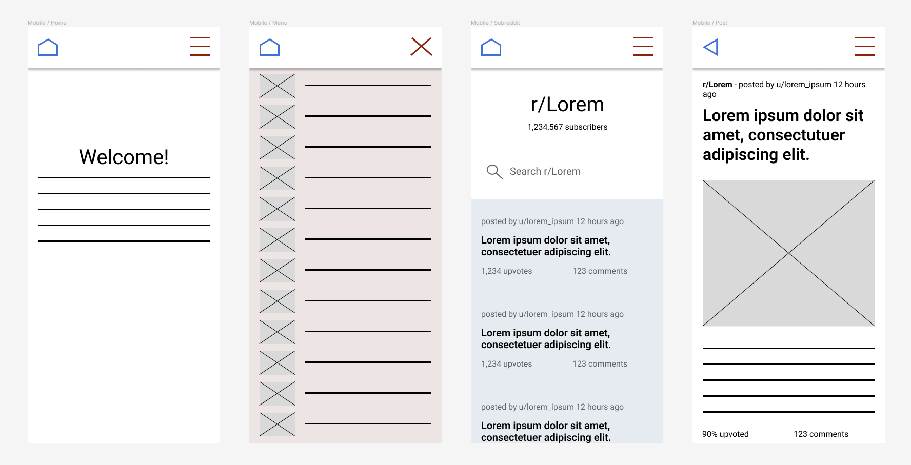

# States of Reddit
The *fastest* way to browse the subreddits of the fifty U.S. states.

## Description & Features
States of Reddit is a website that allows for easy browsing and searching of the fifty U.S. state subreddits.

It was created to fulfill the following requirements of the Reddit Client project in Codecademy's Front End Engineer Career Path.
* Built with React and Redux
* Version control with Git and Github
* Project management with Trello
* Markdown README with wireframes, technologies used, features, and future work
* Unit testing with Jest and Enzyme
* End to end testing with Selenium
* Works on desktop and mobile
* Works on any modern browser (tested on Chrome, Firefox, Safari, and Edge)
* Accessible at a URL
* Initial view of data provided when first visiting app (after selecting a state)
* The data is searchable within each state's subreddit
* States act as predefined categories to filter reddit posts
* Detailed view provided when a post is selected
* Cohesive design
* Animations and transitions
* Ability to leave error states
* 90+ scores on lighthouse
* Custom domain name
* CI/CD workflow with Netlify and Github

## Usage
Go to [www.statesofreddit.com](https://www.statesofreddit.com/) and start browsing!

## Technologies Used
* HTML/CSS/JS
* React
* Redux
* React Router
* React Markdown
* Remark GFM
* Luxon
* Fortawesome
* Jest
* Enzyme
* Selenium

## Future Work
* Allow user to expand comment threads to see replies
* Word map of most frequently used words in each state

## Design
Wireframing and prototyping below were done using Figma.

## Author
[Ben Drendel](https://github.com/bendrendel)

## License
This project is licensed under the MIT License - see LICENSE.txt for details.

## Acknowledgments
Home page image by [Brittney Weng](https://unsplash.com/@brittneyweng)

State flag images by [Flagpedia](https://flagpedia.net)